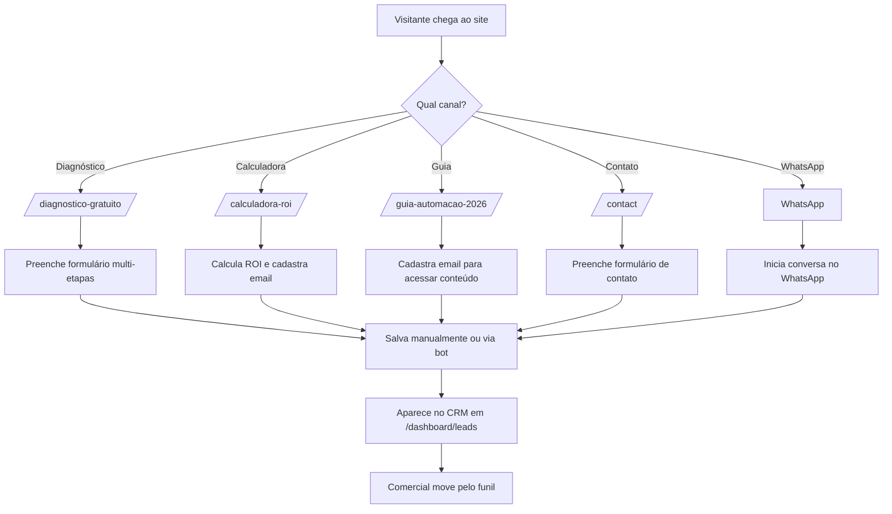

# Arquitetura do CRM - PyScript.Tech

**Objetivo:** Documentar a arquitetura do CRM interno e prepará-lo para integração com Supabase, PostgreSQL e HubSpot.

---

## 1. Visão Geral

O CRM foi implementado como um módulo do dashboard interno da PyScript.Tech. A versão atual utiliza `localStorage` para persistência de dados, permitindo testes e validação do funil de vendas sem necessidade de backend.

A arquitetura foi projetada para evoluir facilmente para bancos de dados relacionais (PostgreSQL via Supabase) ou para plataformas de CRM externas (HubSpot).

---

## 2. Estrutura de Componentes

### 2.1 Frontend

```
src/pages/dashboard/Leads/
├── LeadsList.jsx      # Lista de leads, filtros e pipeline visual
├── LeadForm.jsx       # Formulário de criação/edição de leads
├── LeadsList.module.css
├── LeadForm.module.css
└── index.js
```

### 2.2 Rotas

```
/dashboard/leads          → Lista de leads
/dashboard/leads/new      → Novo lead
/dashboard/leads/edit/:id → Editar lead
```

### 2.3 Integração no Dashboard

- Sidebar atualizada com item "Leads"
- App.js com rotas protegidas
- DashboardLayout reutilizado para navegação

---

## 3. Modelo de Dados

### 3.1 Entidade Lead

```typescript
interface Lead {
  id: string;              // UUID ou timestamp
  name: string;            // Nome do contato
  email: string;           // Email corporativo
  phone: string;           // Telefone/WhatsApp
  company: string;         // Empresa
  role: string;            // Cargo
  segment: string;         // Segmento (Logística, Saúde, etc.)
  employees: string;       // Faixa de funcionários
  problem: string;         // Principal problema operacional
  systems: string;         // Sistemas utilizados
  interests: string[];     // Interesses (IA, Automação, ERP, etc.)
  stage: string;           // Etapa do funil
  source: string;          // Fonte de aquisição
  value: number;           // Valor estimado do projeto
  createdAt: string;       // Data de criação (YYYY-MM-DD)
  updatedAt: string;       // Data de atualização (YYYY-MM-DD)
  notes: string;           // Anotações gerais
}
```

### 3.2 Etapas do Funil (Pipeline)

```typescript
const PIPELINE_STAGES = [
  { id: 'novo',          label: 'Novo Lead' },
  { id: 'contato',       label: 'Contato Realizado' },
  { id: 'diagnostico',   label: 'Diagnóstico Agendado' },
  { id: 'proposta',      label: 'Proposta Enviada' },
  { id: 'negociacao',    label: 'Negociação' },
  { id: 'fechado',       label: 'Fechado' },
  { id: 'perdido',       label: 'Perdido' },
];
```

### 3.3 Fontes de Aquisição

```typescript
const SOURCE_OPTIONS = [
  'Diagnóstico Gratuito',
  'Calculadora ROI',
  'Guia Automação 2026',
  'Formulário Contato',
  'WhatsApp',
  'LinkedIn',
  'Indicação',
  'Google Ads',
  'Orgânico',
  'Outro'
];
```

---

## 4. Fluxo de Captura de Leads



---

## 5. Persistência Atual (localStorage)

### 5.1 Chave Utilizada

```javascript
localStorage.setItem('pyscript_leads', JSON.stringify(leads));
const leads = JSON.parse(localStorage.getItem('pyscript_leads') || '[]');
```

### 5.2 Limitações

- Dados ficam apenas no navegador do usuário
- Sem sincronização entre dispositivos
- Sem backup automático
- Sem permissões de acesso
- Limite de ~5MB por domínio

### 5.3 Quando Substituir

Recomendado migrar para Supabase/PostgreSQL quando:
- Mais de 1 usuário comercial acessar o CRM
- Necessidade de backup e segurança
- Integração com sistemas externos
- Volume de leads superar 100/mês

---

## 6. Integração com Supabase

### 6.1 Estrutura da Tabela `leads`

```sql
CREATE TABLE leads (
  id UUID PRIMARY KEY DEFAULT gen_random_uuid(),
  name TEXT NOT NULL,
  email TEXT NOT NULL,
  phone TEXT,
  company TEXT,
  role TEXT,
  segment TEXT,
  employees TEXT,
  problem TEXT,
  systems TEXT,
  interests TEXT[],
  stage TEXT NOT NULL DEFAULT 'novo',
  source TEXT,
  value NUMERIC DEFAULT 0,
  created_at TIMESTAMP WITH TIME ZONE DEFAULT NOW(),
  updated_at TIMESTAMP WITH TIME ZONE DEFAULT NOW(),
  notes TEXT,
  user_id UUID REFERENCES auth.users(id)
);

-- Índices para filtros comuns
CREATE INDEX idx_leads_stage ON leads(stage);
CREATE INDEX idx_leads_source ON leads(source);
CREATE INDEX idx_leads_company ON leads(company);
CREATE INDEX idx_leads_created_at ON leads(created_at);
```

### 6.2 Tabela de Atividades (Histórico)

```sql
CREATE TABLE lead_activities (
  id UUID PRIMARY KEY DEFAULT gen_random_uuid(),
  lead_id UUID REFERENCES leads(id) ON DELETE CASCADE,
  type TEXT NOT NULL, -- 'email', 'call', 'meeting', 'note', 'stage_change'
  description TEXT,
  created_at TIMESTAMP WITH TIME ZONE DEFAULT NOW(),
  user_id UUID REFERENCES auth.users(id)
);
```

### 6.3 Tabela de Propostas

```sql
CREATE TABLE proposals (
  id UUID PRIMARY KEY DEFAULT gen_random_uuid(),
  lead_id UUID REFERENCES leads(id) ON DELETE CASCADE,
  title TEXT NOT NULL,
  description TEXT,
  items JSONB,
  total_value NUMERIC,
  status TEXT DEFAULT 'draft', -- draft, sent, accepted, rejected
  sent_at TIMESTAMP WITH TIME ZONE,
  created_at TIMESTAMP WITH TIME ZONE DEFAULT NOW(),
  updated_at TIMESTAMP WITH TIME ZONE DEFAULT NOW()
);
```

### 6.4 Row Level Security (RLS)

```sql
-- Habilitar RLS
ALTER TABLE leads ENABLE ROW LEVEL SECURITY;
ALTER TABLE lead_activities ENABLE ROW LEVEL SECURITY;
ALTER TABLE proposals ENABLE ROW LEVEL SECURITY;

-- Política: usuários veem apenas seus leads ou todos se forem admin
CREATE POLICY "Users can view own leads" ON leads
  FOR SELECT USING (auth.uid() = user_id OR auth.jwt() ->> 'role' = 'admin');

CREATE POLICY "Users can insert own leads" ON leads
  FOR INSERT WITH CHECK (auth.uid() = user_id);

CREATE POLICY "Users can update own leads" ON leads
  FOR UPDATE USING (auth.uid() = user_id OR auth.jwt() ->> 'role' = 'admin');

CREATE POLICY "Users can delete own leads" ON leads
  FOR DELETE USING (auth.uid() = user_id OR auth.jwt() ->> 'role' = 'admin');
```

### 6.5 Exemplo de Integração no React

```javascript
import { createClient } from '@supabase/supabase-js';

const supabase = createClient(process.env.REACT_APP_SUPABASE_URL, process.env.REACT_APP_SUPABASE_ANON_KEY);

// Buscar leads
const { data: leads, error } = await supabase
  .from('leads')
  .select('*')
  .eq('stage', 'novo')
  .order('created_at', { ascending: false });

// Criar lead
const { data, error } = await supabase
  .from('leads')
  .insert([{ name: 'Carlos', email: 'carlos@empresa.com', stage: 'novo' }])
  .select();
```

---

## 7. Integração com PostgreSQL

### 7.1 Arquitetura com Backend Node.js/Python

```
Frontend (React)
    ↓ API REST
Backend (FastAPI/Node.js)
    ↓ SQLAlchemy/Prisma
PostgreSQL
```

### 7.2 Endpoints Sugeridos

```
GET    /api/leads
GET    /api/leads/:id
POST   /api/leads
PUT    /api/leads/:id
DELETE /api/leads/:id
GET    /api/leads/:id/activities
POST   /api/leads/:id/activities
GET    /api/leads/:id/proposals
POST   /api/leads/:id/proposals
```

### 7.3 Vantagens

- Controle total sobre lógica de negócio
- Integração com outros sistemas internos
- Escalabilidade e performance
- Pode hospedar na mesma stack da empresa (Python/FastAPI)

---

## 8. Integração com HubSpot

### 8.1 Cenários de Uso

- Sincronizar leads capturados no site com HubSpot CRM
- Criar deals automaticamente ao mover lead para "Proposta Enviada"
- Enviar emails de nutrição via HubSpot
- Usar dashboard de vendas do HubSpot

### 8.2 Fluxo de Integração

```
Lead capturado no site
    ↓
Salvo no backend PostgreSQL
    ↓
Webhook envia para HubSpot
    ↓
Contato criado no HubSpot
    ↓
Deal criado no pipeline do HubSpot (se qualificado)
```

### 8.3 Mapeamento de Campos

| PyScript Lead | HubSpot Contact | HubSpot Deal |
|---------------|-------------------|--------------|
| name | firstname + lastname | - |
| email | email | - |
| phone | phone | - |
| company | company | associated_company |
| segment | segmento__c (custom) | - |
| employees | tamanho_empresa__c (custom) | - |
| interests | interesses__c (custom) | - |
| value | - | amount |
| stage | - | dealstage |
| source | fonte__c (custom) | - |

### 8.4 Exemplo de Requisição HubSpot

```javascript
const createHubSpotContact = async (lead) => {
  const response = await fetch('https://api.hubapi.com/crm/v3/objects/contacts', {
    method: 'POST',
    headers: {
      'Authorization': `Bearer ${HUBSPOT_API_KEY}`,
      'Content-Type': 'application/json'
    },
    body: JSON.stringify({
      properties: {
        email: lead.email,
        firstname: lead.name.split(' ')[0],
        lastname: lead.name.split(' ').slice(1).join(' '),
        phone: lead.phone,
        company: lead.company,
        segmento__c: lead.segment,
        fonte__c: lead.source
      }
    })
  });
  return response.json();
};
```

---

## 9. Webhooks e Automação

### 9.1 Eventos Disparados

- `lead.created` → Enviar notificação para Slack/WhatsApp
- `lead.stage_changed` → Atualizar HubSpot/criar deal
- `lead.proposal_sent` → Criar proposta e enviar email
- `lead.closed` → Atualizar dashboard financeiro

### 9.2 Exemplo de Notificação

```javascript
const notifyNewLead = (lead) => {
  // Slack
  fetch('https://hooks.slack.com/services/...', {
    method: 'POST',
    body: JSON.stringify({
      text: `Novo lead: ${lead.name} (${lead.company}) - ${lead.source}`
    })
  });
};
```

---

## 10. Dashboard e Relatórios

### 10.1 Indicadores do CRM

- Total de leads no mês
- Leads por fonte
- Leads por etapa do funil
- Taxa de conversão entre etapas
- Valor total em pipeline
- Valor fechado no mês
- Tempo médio no funil

### 10.2 Sugestão de Visualização

- Kanban de leads por etapa
- Gráfico de funil (de cima para baixo)
- Gráfico de leads por fonte (pizza)
- Gráfico de evolução mensal (linha)
- Tabela de leads com filtros

---

## 11. Próximos Passos Técnicos

1. **Curto prazo:**
   - Testar CRM com dados reais de leads do site
   - Exportar leads do localStorage para backup
   - Criar tela de atividades dentro do lead
   - Criar tela de propostas

2. **Médio prazo:**
   - Configurar conta Supabase
   - Migrar modelo de dados para PostgreSQL
   - Implementar autenticação por papel (admin, comercial)
   - Criar webhooks para notificações

3. **Longo prazo:**
   - Integrar com HubSpot ou Salesforce
   - Criar automação de follow-up por email
   - Implementar scoring de leads
   - Criar previsão de receita baseada no funil

---

## 12. Conclusão

O CRM foi implementado com uma arquitetura simples e escalável. A persistência em localStorage permite validação imediata, enquanto o modelo de dados está preparado para migração para Supabase, PostgreSQL ou HubSpot.

A integração com o site de captura de leads está funcional: formulários, calculadora e lead magnet salvam leads automaticamente, que aparecem no dashboard em `/dashboard/leads`.
